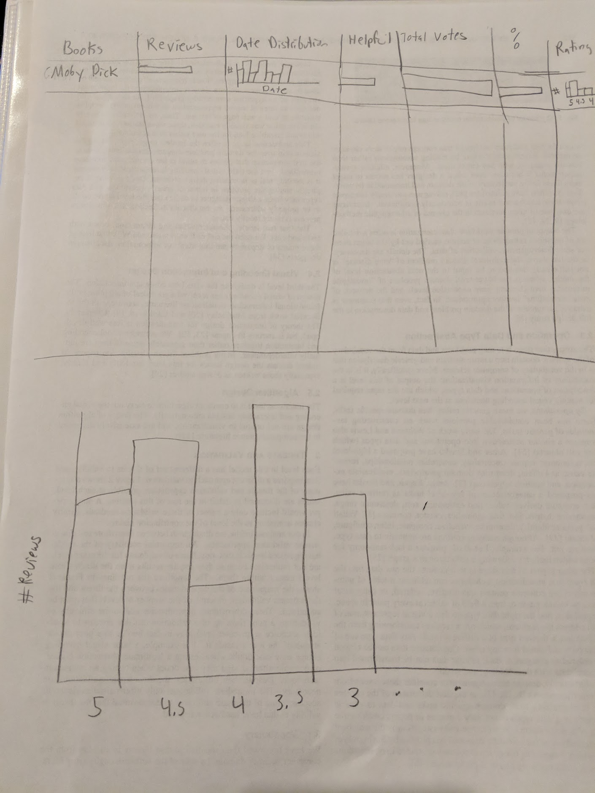
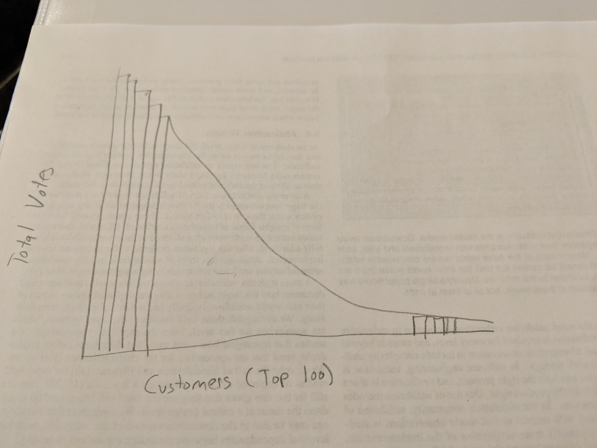
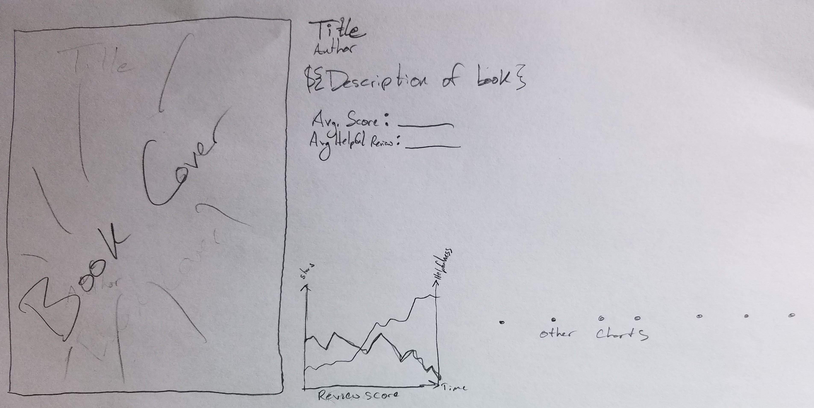

# Visualizing Amazon Book Reviews
* Andre LaFleur; andre.lafleur@utah.edu; u0669715
* Kimberly Williamson; u6004461@utah.edu; u6004461

Project Repository: https://github.com/rtekim/Visualizing-Amazon-Reviews
Video Presentation: https://youtu.be/xRbZPAqfv2w

## Background and Motivation

Humans have told stories to one another for thousands of years. With the advent of the written word (and later the eBook) storytelling transcended its oral roots and was written down. Stories in their modern form exist in written books known as "novels." A variety of novels have impacted people over the past couple centuries, and we wish to explore those novels and their representation in Amazon Book Reviews.

## Project Objectives
* **Is there a difference between ratings of book vs ebook for the same title?**
Knowing if there is a difference between how users rate a book vs an ebook could help determine the differences in user book preferences to users who prefer a book or ebook versus the other. 
* **Does having a verified purchase produce a more helpful review? Do verified users ratings differ from non-verified ratings?**
This could help identify if users trust non-verified ratings. This could also help to explore if non-verified ratings can be trusted. 
* **Is there a time correlation with helpfulness of Amazon book reviews? Is there a time correlation to when reviews are created?**
Knowing trends about when users submit reviews, could help narrow a time period for users looking for new books based on reviews.
* **What themes from a book can be identified by aggregating the reviews?**
Identifying themes in book reviews could help users’ identity books they might be interested in.

## Data

We are using the Amazon Customer Reviews Dataset, specifically the books and ebooks files. We will be selecting books that are found on the Top 100 Novels put together by Time Magazine. 

* [Customer Reviews Dataset](https://s3.amazonaws.com/amazon-reviews-pds/readme.html)
* [Top 100 Novels](http://entertainment.time.com/2005/10/16/all-time-100-novels/slide/all/)

## Data Processing

We will need to filter out the Amazon Customer Reviews Dataset to only include book titles that are on the Top 100 Novels list.

## Proposed Visualization Design

### Sketch 1

Scatterplot of book reviews. Initially, the x-axis encodes Review Date, the y-axis encodes the Total number of Votes and the color of the mark encodes a verified purchase or not. The y-axis can be changed to encode the Total number of helpful votes or the percentage of helpful votes. The color can be changed to encode star rating or country code or book vs ebook. When a point on the scatterplot is selected, two charts are filled up. One chart displays the book title of the review selected and lists all of the reviews for that book. This chart displays total votes, helpful votes, rating, and date for each review. The other chart displays the reviewer whose review was selected in the scatterplot. This chart displays a row for each book this customer has reviewed along with columns for total votes, helpful votes, rating, and date. Multiple points can be selected on the scatterplot and this will add more rows to both charts. Clicking on a point after it is selected removes the associated rows from the charts.

### Sketch 2

Tabular layout where each column is its own visualization. There is a row for each book. The columns are:
* Reviews: A bar representing the total number of reviews.
* Date Distribution: A bar chart plotting reviews per a year.
* Helpful Votes: A bar representing the total number of helpful votes.
* Total Votes: A bar representing the total votes.
* Percent Helpful: A bar representing the fraction of votes that were helpful.
* Rating distribution: A bar chart plotting the number of reviews for each rating.
* Additional Columns as we work with the data.

There is also a ratings bar chart plotting all books. Selecting one or more of the bars changes the selection of the Tabular layout to only include reviews in the selection.

There is also a bar chart plotting the top 100 customers by number of total votes on the y-axis. The y-axis can be changed to encode total helpful votes or total reviews. Selecting top customers by brushing reselects the tabular layout only populating reviews written by the customers selected. 

### Sketch 3

Detail view showing the novel in question. The various pieces that were shown in the table are shown here, as well as any additional information gleaned from the various reviews, including a word cloud.

### Final Visualization

For the final visualization, we are choosing to incorporate the following features from our sketches.
* Scatterplot view from Sketch 1.
* Tabular Layout from Sketch 2.
* The detailed view described in Sketch 3.

There will be interaction between all three visualizations. When a table row on the tabular layout or point on the scatterplot is selected, the detailed view will be populated with the selection.  

## Must-Have Features

* Scatterplot view with set of encodings
* Tabular layout with its own set of encodings
* Detail view of the books, according to whichever one is selected

## Optional Features

* Cycle through a variety of book covers for individual views of books
* Miniature detail view showing information about the book that the mouse is hovering over in either view
* Word cloud specific to each book of all of the reviews from each book

## Project Schedule

The following is the proposed project schedule, week by week:

* 9 November
	* Data is aggregated and included in the repository
	* Data is loaded upon browser load
	* Scatterplot displays a subset of the promised channels using the data provided
* 16 November
	* Scatterplot is completed, with all inputs available in promised channels
	* Tabular layout is established, with a subset of the various promised columns
	* Work on the detail view has begun
* 23 November
	* Tabular layout is complete
	* Detail view is complete
	* All that is left is polishing

## Updated Schedule (Milestone 1)

* 16 November
	* Scatterplot is completed, with all inputs available in promised channels
	* Tabular layout is sortable and columns are customizable
	* Work on the detail view has begun
	* All book covers are showing up on the grid and the sort and sizing customizable options are added
* 23 November
	* Tabular layout is complete
	* Detail view is complete
	* Interaction between views is completed
	* All that is left is polishing

## Exploratory Data Analysis

Initially we looked at both the scatterplot and the table to gain some insights about our data. One of the first things we found was how spread out our data was in terms of reviews. The *Great Gatsby* had the maximum review count at 4740, while the *A Dance to the Music of Time* and *Play It As It Lays* had a minimum review count of 1. This caused some problems in our scales which led to us changing all of the table scales, with the exception of **Total Reviews**, to percentage scales. Switching to percentage scales has allowed us to better show the data. 

## Design Evolution

Between our peer feedback session and the original implementation of our scatterplot, we have decided to only plot the books instead of the reviews. We determined it would be too cluttered and would not give us much additional data. We have decided to leave the detailed reviews to the detailed view. 
We also decided to add another view that gives users another way to search for the books. We determined the table was too big for a user who might be looking for specific books. So we added a view that shows the book covers for each book and allows them to sort and size the covers based on customizable fields. When a user clicks on a cover, the detailed view is displayed. We got inspiration from this visualization https://medium.com/@andybarefoot/d3-and-css-grid-with-expanding-content-3c8aaf783cb1. Sketches of the new designed are below.
We are also planning on interaction between the scatterplot, table and book grid. Once a book is selected on any view, the other two views will highlight the selected book also.

## Implementation

With our final design we created 3 high-level visualizations, that all can be drilled down into a more detailed view.

### Scatterplot

By hovering over a point on the scatterplot(**A**), a quick summary is displayed to the right(**B**). If a user clicks on a point in the scatterplot(**A**), then the detailed view is added to the bottom of the scatterplot(**D**). The drop-down menus (**C**) allows the users to control what categories are used to plot the data.

### Table

As the user hovers around to different rows, the table row changes color to provide feedback to the user(**A**). By clicking on the headers in the table, the user can sort the column(**B**). With the exception of the Total Reviews column, all other columns are using the percentage of Total Reviews for the sort function. 

### Book Grid

The book grid is displaying all of the book covers. The size of the cover is determined by the Total Reviews(**A**). When a user clicks on a book cover, the detailed view is shown(**B**).

### Detailed View

While our other visualizations attempt to summarize the dataset as a whole, the detailed view visualization gives the specifics for each book. The book name and cover are displayed(**A**), along with a word cloud and a histogram. The word cloud(**B**) was created by using the customer reviews. The user can change the histogram by selecting categories in the drop down menus(**C**). 

## Evaluation

We learned that having a book on a Top 100 lists does not always correlate to a lot of reviews on Amazon. We knew there would be more popular books, but did not expect for several of them to have less than 10 reviews. When we first formed our questions we envisioned a website that could be used by researchers to make sense of reviewing patterns. We asked questions that would lead to summary answers. Through our design and implementation process, we found that these visualizations would be more helpful or a user looking to find their next book. They could use the visualizations to find books similar to other books they have liked. They could could browse the detail views to find words that excited them in the word cloud. 

As we were implementing our designs, there were some areas of improvement we thought should be done if we had more time.
* Filtering: Adding filtering to only show certain reviews. For example: Only show reviews from verified purchases.
* More Data Sources: We used Amazons dataset for the reviews, but it would be interesting to add in other sources such as Goodreads.
* More Books: Use multiple Top 100 lists.

Overall, we are happy with the visualizations we were able to complete.
