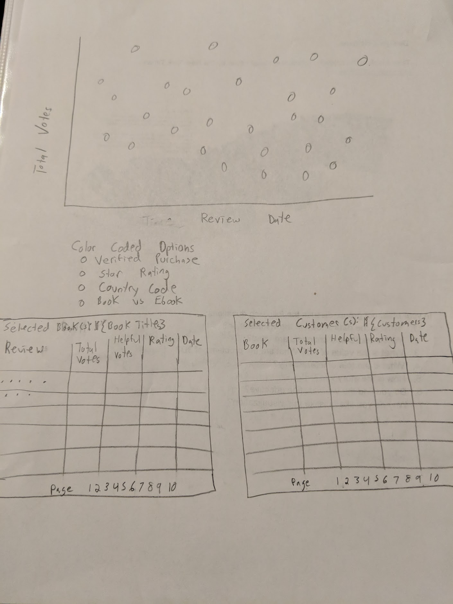
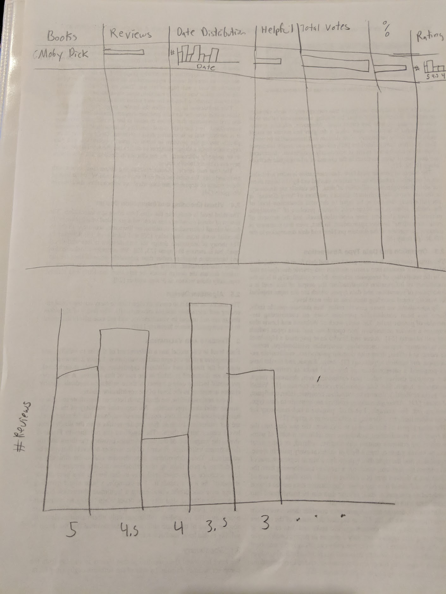
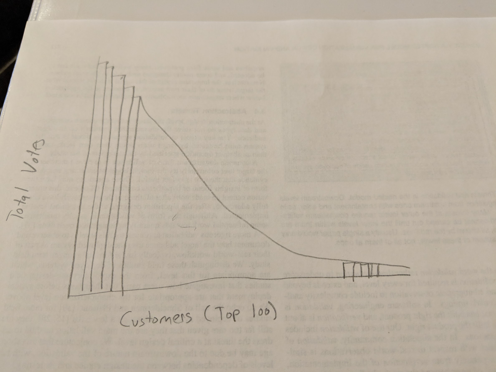
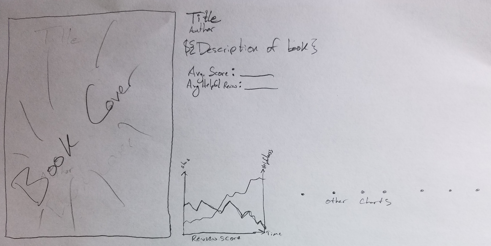

# Visualizing Amazon Book Reviews
* Andre LaFleur; andre.lafleur@utah.edu; u0669715
* Kimberly Williamson; u6004461@utah.edu; u6004461

Project Repository: https://github.com/rtekim/Visualizing-Amazon-Reviews

## Background and Motivation

Humans have told stories to one another for thousands of years. With the advent of the written word (and later the eBook) storytelling transcended its oral roots and was written down. Stories in their modern form exist in written books known as "novels." A variety of novels have impacted people over the past couple centuries, and we wish to explore those novels and their representation in Amazon Book Reviews.

## Project Objectives

* Is there a time correlation with helpfulness of Amazon book ratings?
* Is there a difference between ratings of book vs ebook for the same title?
* Does having a verified purchase produce a more helpful review?
* What type of book reviews do customers rate as helpful?

## Data

We are using the Amazon Customer Reviews Dataset, specifically the books and ebooks files. We will be selecing books that are found on the Top 100 Novels put together by Time Magazine. 

* [Customer Reviews Dataset](https://s3.amazonaws.com/amazon-reviews-pds/readme.html)
* [Top 100 Novels](http://entertainment.time.com/2005/10/16/all-time-100-novels/slide/all/)

## Data Processing

We will need to filter out the Amazon Customer Reviews Dataset to only include book titles that are on the Top 100 Novels list.

## Visualization Design

### Sketch 1

Scatterplot of book reviews. Initially, the x-axis encodes Review Date, the y-axis encodes the Total number of Votes and the color of the mark encodes a verified purchase or not. The y-axis can be changed to encode the Total number of helpful votes or the percentage of helpful votes. The color can be changed to encode star rating or country code or book vs ebook. When a point on the scatterplot is selected, two charts are filled up. One chart displays the book title of the review selected and lists all of the reviews for that book. This chart displays total votes, helpful votes, rating, and date for each review. The other chart displays the reviewer who's review was selected in the scatterplot. This chart displays a row for each book this customer has reviewed along with columns for total votes, helpful votes, rating, and date. Multiple points can be selected on the scatterplot and this will add more rows to both charts. Clicking on a point after it is selected removes the associated rows from the charts.

### Sketch 2

Tabular layout where each column is its own visualization. There is a row for each book. The columns are:
* Reviews: A bar representing the total number of reviews.
* Date Distrubution: A bar chart plotting reviews per a year.
* Helpful Votes: A bar representing the total number of helpful votes.
* Total Votes: A bar representing the total votes.
* Percent Helpful: A bar representing the fraction of votes that were helpful.
* Rating distribution: A bar chart plotting the number of reviews for each rating.
* Additional Columns as we work with the data.

There is also a ratings bar chart plotting all books. Selecting one or more of the bars changes the selection of the Tabular layout to only include reviews in the selection.

There is also a bar chart plotting the top 100 customers by number of total votes on the y-axis. The y-axis can be changed to encode total helpful votes or total reviews. Selecting top customers by brushing reselects the tabular layout only populating reviews written by the customers selected. 

### Sketch 3

Detail view showing the novel in question. The various pieces that were shown in the table are shown here, as well as any additional information gleaned from the various reviews.

## Must-Have Features

* Scatterplot view with set of encodings
* Tabular layout with its own set of encodings
* Detail view of the books, according to whichever one is selected

## Optional Features

* Cycle through a variety of book covers for individual views of books
* Miniature detail view showing information about the book that the mouse is hovering over in either view

## Project Schedule

The following is the proposed project schedule, week by week:

* 9 November
	* Data is aggregated and included in the repository
	* Data is loaded upon browser load
	* Scatterplot displays a subset of the promised channels using the data provided
* 16 November
	* Scatterplot is completed, with all inputs available in promised channels
	* Tabular layout is established, with a subset of the various promised columns
	* Work on the detail view has begun
* 23 November
	* Tabular layout is complete
	* Detail view is complete
	* All that is left is polishing